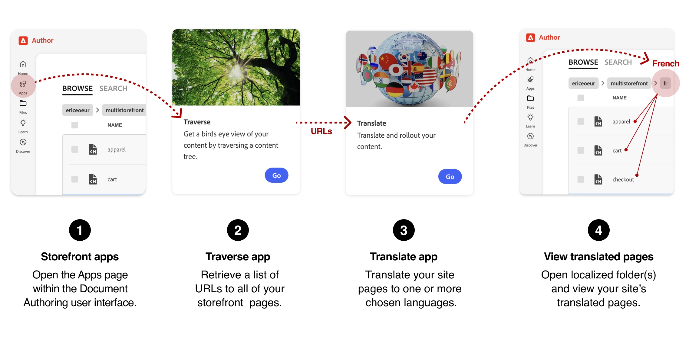

import { Tabs, TabItem, Steps } from '@astrojs/starlight/components';
import Tasks from '@components/Tasks.astro';
import Task from '@components/Task.astro';
import LinkCard from '@components/LinkCard.astro';
import Screenshot from '@components/Screenshot.astro';
import Callouts from '@components/Callouts.astro';
import OptionsTable from '@components/OptionsTable.astro';
import { Image } from 'astro:assets';
import Diagram from '@components/Diagram.astro';
import CardGrid from '@components/CardGrid.astro';
import Card from '@components/Card.astro';
import Aside from '@components/Aside.astro';
import { Icon } from '@astrojs/starlight/components';
import Link from '@components/Link.astro';
import Vocabulary from '@components/Vocabulary.astro';
import Embed from '@components/Embed.astro';

This guide will walk you through the process of localizing the content of your storefront using Document Authoring (da.live).

## Prerequisites

- You have a storefront project in the Document Authoring app (<Link href="https://da.live" text="da.live" />) of the Storefront Builder.
- You know the basics of using the Document Authoring tool as described in the documentation here: (<Link href="https://da.live/docs" text="da.live/docs" />).

:::note
To achieve full localization—including storefront setup (currency, translations, localized storefront links) and enabling the store switcher—the developers for your storefront site need to follow the steps outlined in [multistore setup](/merchants/multistore/).
:::

## Additional resources

- <Link href="https://www.aem.live/docs/translation-and-localization" text="Translation and Localization" />
- <Link href="https://da.live/docs/administration/translation" text="Translation, localization, and rollout" />

## Big Picture

The following diagram provides the basic workflow for translating the Edge Delivery content of your storefront into multiple languages using the Document Authoring apps <Link href="https://da.live" text="da.live" />.

<Diagram caption="Workflow for localizing your storefront">
  
</Diagram>

## Step-by-Step

These steps provide the details for the translation workflow shown in the diagram. The steps describe how to translate the default English store to another language. In this example, we will translate the default English store to French (`fr`).

<Tasks>

<Task>
### Navigate to your storefront's Apps page

<Steps>
1. Open your storefront project in the Document Authoring tool (<Link href="https://da.live" text="da.live" />).
1. Select Apps from the left sidebar.

</Steps>

</Task>

<Task>
### Use the Traverse app to get a list of site URLs

<Steps>
1. Open the **Traverse** app by selecting its *Go* button.
1. On the Crawl Tree page, enter your storefront's organization name and site name. Example: `/acme/storefront`. Ensure that you enter a forward slash (`/`) at the beginning of the string or it will not work. 
1. Select the **Crawl** button to start the crawl.
1. Select the **Copy list** button after the site's URLs have been traversed. This puts all the URLs in your clipboard.
1. Return to the Apps page.

</Steps>

</Task>

<Task>

### Use the Translation app to translate your storefront

<Steps>
1. Open the **Translate** app by selecting its *Go* button.
1. On the Localization page, enter the Title of the translation project: `acme-storefront-fr`.
1. Paste the list of URLs from the **Traverse** app into the **URLs** field.
   :::note
   We recommend excluding certain files—such as `metadata.json`, `redirects.json`, and `sitemap.json`—from the translation process. Adding these files to the translation process shouldn't cause any technical issues with translation, but translating them is not necessary.
   :::
1. Select the **Next** button.
1. View the validated URLs to ensure that they are all correct.
1. Select the **Next** button.
1. Select one or more languages you want to translate to. In this example, we will translate to French (`fr`).
1. For the French language, select **Translate** from the selector, then select the **Create project** button.
1. From the project page, select the **Send all for translation** button.

</Steps>

<Aside type="note">

By default, the Translation app will use the Google Translate service to translate the content of the storefront into the selected language. Your organization can also connect other translation services for a more robust translation experience. For more information on translation services and configuration, see [Translation and Localization](https://www.aem.live/docs/translation-and-localization).

</Aside>

</Task>

<Task>

### View the translated site

<Steps>
1. Navigate back to the main (root) folder for you English storefront.
1. Scroll the site files and folders to find the `fr` folder and open it.
1. Select a document to view the translated content. For example, select the `index` document to view the translated home page.
</Steps>

</Task>

</Tasks>