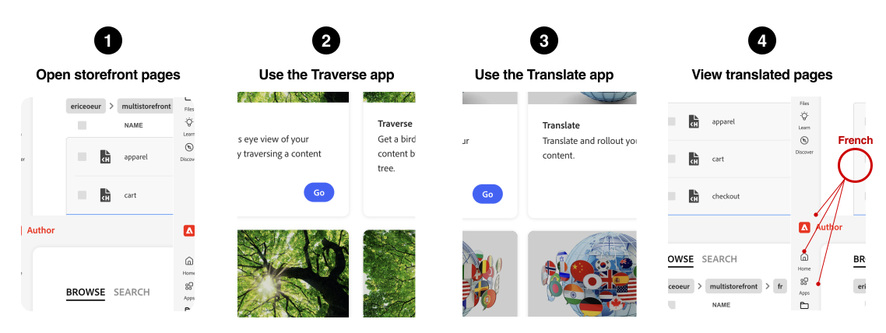

import { Tabs, TabItem, Steps } from '@astrojs/starlight/components';
import Tasks from '@components/Tasks.astro';
import Task from '@components/Task.astro';
import LinkCard from '@components/LinkCard.astro';
import Screenshot from '@components/Screenshot.astro';
import Callouts from '@components/Callouts.astro';
import OptionsTable from '@components/OptionsTable.astro';
import { Image } from 'astro:assets';
import Diagram from '@components/Diagram.astro';
import CardGrid from '@components/CardGrid.astro';
import Card from '@components/Card.astro';
import Aside from '@components/Aside.astro';
import { Icon } from '@astrojs/starlight/components';
import Link from '@components/Link.astro';
import Vocabulary from '@components/Vocabulary.astro';
import Embed from '@components/Embed.astro';

This guide will walk you through the process of localizing your storefront using the Document Authoring tools in the Storefront Builder.

## Resources

- <Link href="https://www.aem.live/docs/translation-and-localization" text="Translation and Localization" />
- <Link href="https://da.live/docs/administration/translation" text="Translation, localization, and rollout" />

## Big Picture

The following diagram provides the basic workflow for translating your storefront into multiple languages using the Document Authoring tool <Link href="https://da.live" text="da.live" />.

<Diagram caption="Workflow for localizing your storefront">
  
</Diagram>

<Callouts columnCount="1">

1. Open your website project in the Document Authoring tool (da.live).
1. Navigate the the Translation app.

</Callouts>

<Vocabulary>

- **Document Authoring tool**: The Document Authoring tool (da.live) is a tool that allows you to create and manage your website content.
- **Translation app**: The Translation app is a tool that allows you to translate your website content into multiple languages.
- **Traverse app**: The Traverse app is a tool that allows you to manage your website content and structure.

</Vocabulary>