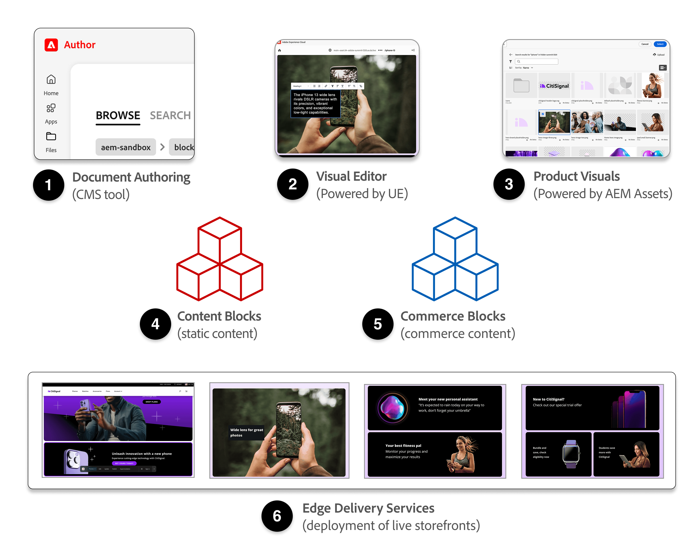

import { Steps } from '@astrojs/starlight/components';
import Diagram from '@components/Diagram.astro';
import PDFViewer from '@components/PDFViewer.astro';
import Callouts from '@components/Callouts.astro';

**Storefront Builder** is included with Adobe Commerce as a Cloud Service, and is designed to streamline both the technical and editorial workflows for creating and maintaining the content for your commerce storefronts. 

## What is the Storefront Builder?

The **Storefront Builder** is a collection of tools and technologies from Adobe Commerce designed to make it easy to create, manage, and customize modern, high-performance storefronts. It brings together the following tools—the building blocks of a commerce storefront:

<Diagram caption="What is the Storefront Builder?">
  
</Diagram>

<Callouts columnCount="1">

1. **Document Authoring (DA.live)**: The content management app (CMS) where your storefront's pages, blocks, and assets are authored and managed.

1. **Visual Editor**: A subset of features from the AEM Universal Editor that provides business users and content authors a WYSIWYG expereince while updating content directly on the rendered page of the storefront.

1. **Product Visuals**: A subset of features of AEM Assets used to provide a digital asset management (DAM) tool used to store and manage the editorial assets, like images and other media for the content and product enrichments pages in your storefront.

1. **Content Blocks**: Pre-built content components used to build the static storefront content, such as buttons, images, lists, links, and more.

1. **Commerce Blocks**: Pre-built commerce components used to build the storefront's dynamic commerce-related pages, such as product details, cart, checkout, product lists, and more.

1. **Edge Delivery Services**: A fast, scalable delivery platform for your storefront content and assets.

</Callouts>

### DA.live (Document Authoring)

DA.live (Document Authoring) is the content management system (CMS) at the heart of Storefront Builder. It is where your storefront's pages, blocks, and assets are authored, organized, and managed. DA.live provides a collaborative environment for content teams to create and structure site content, manage translations, and control publishing workflows. It integrates with Visual Editor for in-context editing and with Edge Delivery Services for fast, reliable content delivery. DA.live supports versioning, localization, and multistore management, making it a powerful tool for complex commerce operations.

Learn more about DA.live in the [DA.live tutorial](https://www.aem.live/developer/da-tutorial).

### Visual Editor (powered by the Universal Editor)

Visual Editor, powered by Adobe's Universal Editor, is a powerful visual editing tool that enables business users and content authors to edit website content in real-time with immediate live preview. This in-context editing experience eliminates the need to switch between different tools or wait for publishing cycles to see changes.

Learn how to use the Visual Editor in the [Using the Visual Editor](/merchants/storefront-builder/visual-editor/) topic.

For more information about the Universal Editor, see [Universal Editor authoring](https://experienceleague.adobe.com/en/docs/experience-manager-cloud-service/content/sites/authoring/universal-editor/authoring).

### Product Visuals (powered by AEM Assets)

[Product Visuals](https://experienceleague.adobe.com/en/docs/commerce/product-visuals/overview) is an integration of Adobe Experience Manager Assets with your Adobe Commerce backend. For Storefront Builder, the digital asset management (DAM) solution accesses editorial assets like images, videos, and other media used on content pages and product enrichments. The DAM integrates with DA.live and Visual Editor for seamless media content management and works with Edge Delivery Services to deliver optimized assets globally.

Learn how to access and use Product Visuals in the [Product Visuals](/merchants/storefront-builder/product-visuals/) topic.

For more information about AEM Assets, see [Publishing pages with AEM Assets](https://www.aem.live/docs/universal-editor-assets) and [AEM Assets overview](https://experienceleague.adobe.com/en/docs/experience-manager-assets/content/home.html).\

### Content and Commerce blocks

Blocks are a foundational concept for adding form and function to page sections. They are defined using tables in the content and decorated by your custom code during page rendering. Drop-ins are dynamic, commerce-specific front-end components that can be integrated within a Block.

Learn how to use the Content and Commerce blocks in the [Content and Commerce blocks](/merchants/storefront-builder/content-commerce-blocks/) topic.

For more information about content blocks, see the [Block Collection](https://www.aem.live/developer/block-collection) topic.

### Edge Delivery Services

Edge Delivery Services is a fast, scalable platform for delivering your storefront's content and assets to customers. It leverages a global content delivery network (CDN) to ensure that pages, images, and other resources load quickly, no matter where your customers are located. By serving content from the edge, Edge Delivery Services reduces latency and improves site performance, which is critical for both user experience and SEO. Edge Delivery Services is tightly integrated with the Storefront Builder ecosystem, ensuring seamless deployment and updates of your storefront content.

Learn more about Edge Delivery Services in the [Edge Delivery Services Overview](https://experienceleague.adobe.com/en/docs/experience-manager-cloud-service/content/edge-delivery/overview) topic.

## Summary

The Storefront Builder is Adobe Commerce's comprehensive solution for creating and managing modern, high-performance storefronts. It combines six essential tools into a unified ecosystem:

- **DA.live** serves as your content management system for authoring and organizing storefront content
- **Visual Editor** provides real-time, in-context editing capabilities for business users and content authors
- **Product Visuals** offers digital asset management for storing and optimizing editorial media
- **Content Blocks** and **Commerce Blocks** provide pre-built components for both static content and dynamic commerce functionality
- **Edge Delivery Services** ensures fast, global content delivery through a scalable CDN platform

Together, these tools streamline both technical and editorial workflows, enabling teams to efficiently create, customize, and maintain commerce storefronts that deliver exceptional user experiences and optimal performance.

