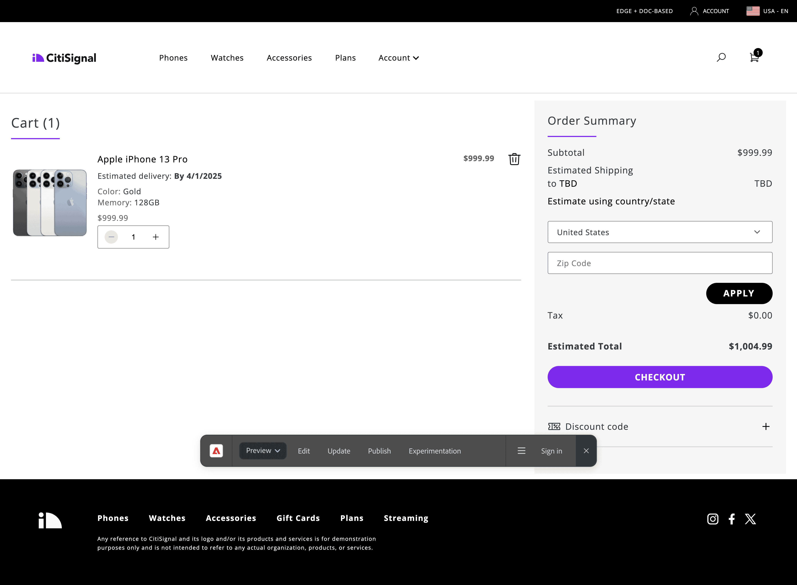

import { Code } from '@astrojs/starlight/components';
import { Steps } from '@astrojs/starlight/components';
import Diagram from '@components/Diagram.astro';
import Tasks from '@components/Tasks.astro';
import Task from '@components/Task.astro';

In this lesson, you will test if showing an *Estimated Delivery Date* in the cart boosts conversion.

{/* ## Workflow overview

Here is the featured iPhone 13 product page you will create in this lesson:

<Diagram caption="Lesson 1 workflow">
  
</Diagram> */}

<Tasks>

<Task>
### Create a Cart page challenger

We'll copy the `cart` page to create a cart page challenger (`cart-copy`).

<Steps>
1. In your project root (`seat-xx`), select the checkbox for the `cart` document to display the context menu.
1. Select **Copy** from the contextual menu, then select `Paste`. This creates a challenger page called `cart-copy`.
1. Open `cart-copy` and preview it.

</Steps>

<Diagram caption="Create a Cart page challenger">
  
</Diagram>

</Task>

<Task>
### Enable an Estimated Delivery Date

For the cart page challenger (`/cart-copy`), we will enable the *Estimated Delivery Date* feature.

<Steps>
1. In the `metadata` block, find the **Show Estimated Delivery** property (currently set to `false`).
1. Change it to `true`.
1. Click the **Action** button (paper plane icon), select **Preview**.
1. Within the site preview, navigate to *Phones* and add an *Apple iPhone 13 Pro* to your cart. Select color and memory options to enable the **Add to Cart** button.
1. View your cart, then change the cart preview URL from `/cart` to `/cart-copy`.
1. You should now see the *Estimated Delivery Date* displayed in your cart.

</Steps>

<Diagram caption="Enable Estimated Delivery Date">
  
</Diagram>

</Task>

<Task>
### Add the challenger to an experiment

We'll add the experiment to the cart page, where we will create an A/B test to show 50% of visitors the normal cart page and 50% the `cart-copy` challenger page.

<Steps>
1. Open AEM Sidekick while previewing the `/cart` page: https://main--seat-xx--adobe-summit-l320.aem.page/cart (replacing `xx` with your seat number).
1. In the AEM sidekick menu, click **Experimentation**.
1. Create a new experiment with these parameters:
   - **Name:** `Cart with Estimated Delivery Date`
   - **Type:** `A/B test` | **Goal:** `Overall conversion`
   - **Control:** Pre-populated with the `/cart` page URL
   - **variant-1 (challenger):** `https://main--seat-xx--adobe-summit-l320.aem.page/cart-copy`
   - **Start date:** `Today` | **End date:** `Today + 2 weeks`

</Steps>

<Diagram caption="Publish the challenger">
  
</Diagram>

</Task>

<Task>
### Run the Experiment

<Steps>
1. **Publish** the experiment. Now, 50% of visitors see the *Estimated Delivery Date* in their cart while 50% see the normal cart. 
1. In 2 weeks, you can return to the `cart` page experiement and review the results from the Experimentation panel.

</Steps>

</Task>

</Tasks>