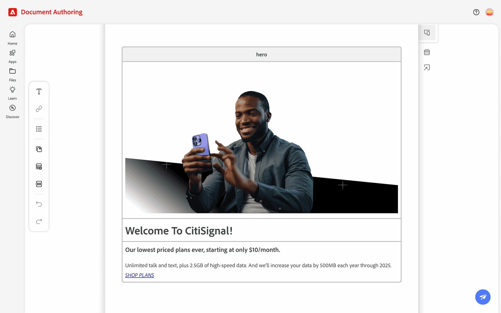
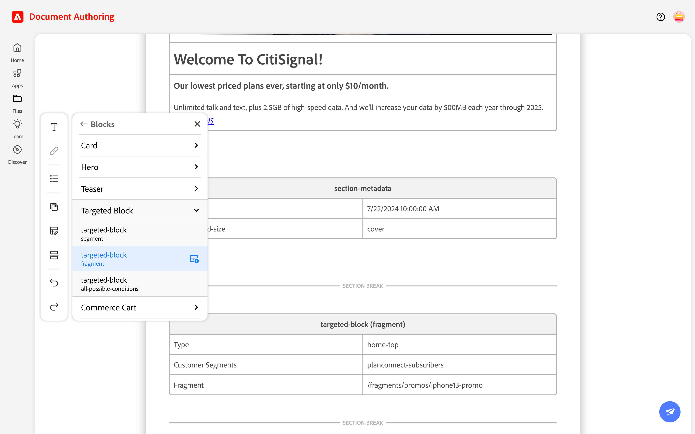
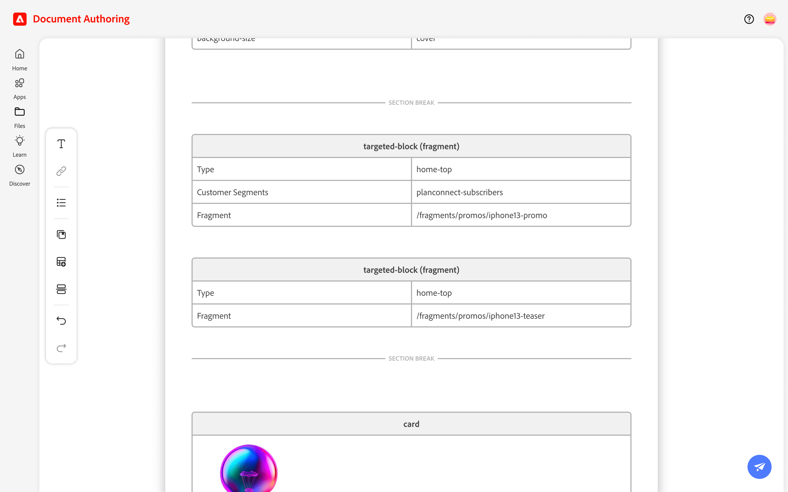
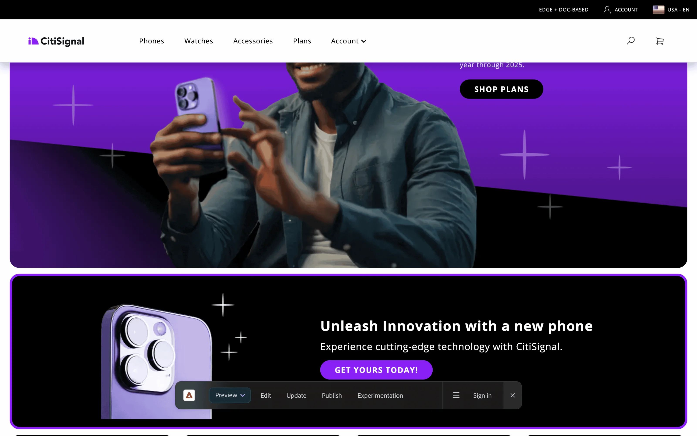
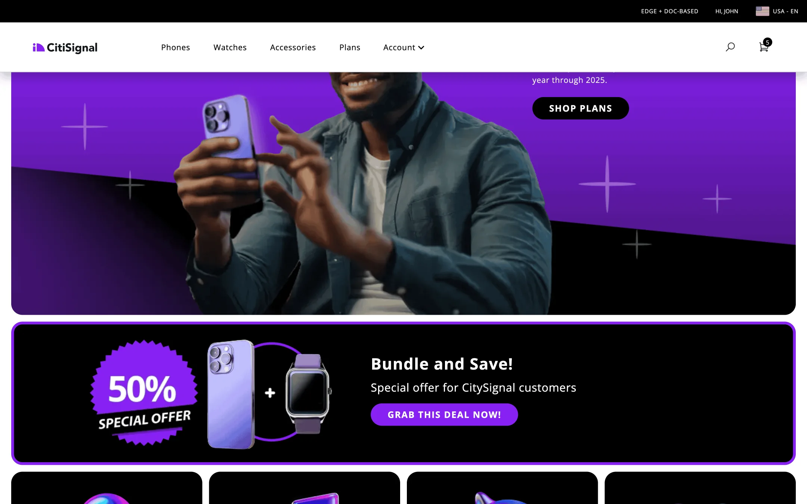
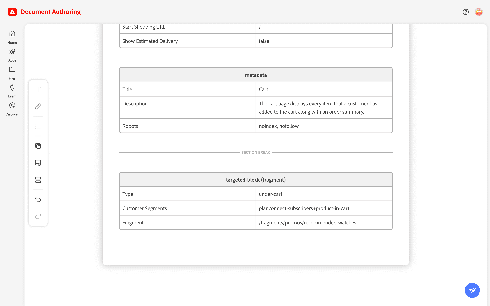
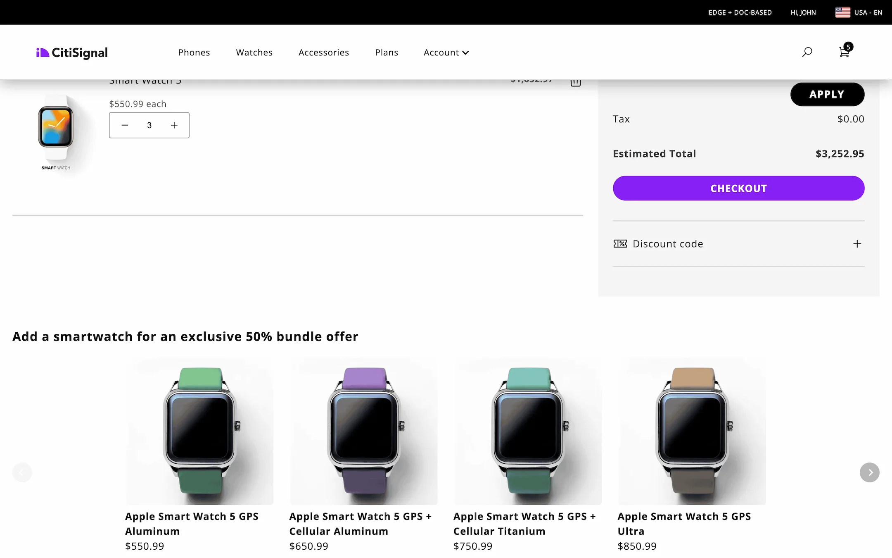

import { Code } from '@astrojs/starlight/components';
import { Steps } from '@astrojs/starlight/components';
import Diagram from '@components/Diagram.astro';
import Tasks from '@components/Tasks.astro';
import Task from '@components/Task.astro';

In this lesson, you will build two targeted banners: one for the home page and one for the cart page.

{/* ## Workflow overview

Here is the featured iPhone 13 product page you will create in this lesson:

<Diagram caption="Lesson 1 workflow">
  
</Diagram> */}

## Home Page Campaign

<Tasks>

<Task>
### Open the Home page

<Steps>
1. Open the `index` document (Home Page) in your project root.
1. Locate the Hero block.
</Steps>

<Diagram caption="Open the Home page">
  
</Diagram>

</Task>

<Task>
### Target Plan-Connect subscribers

<Steps>
1. Insert a new —*Section Break*— directly after the Hero block's `section-metadata` using the **Section Break** tool in the Edit menu.
1. Insert a **`targeted-block fragment`** from **Library** > **Blocks** > **Targeted Blocks**.
1. Change the targeted-block values as follows:
   - `Type`: **`home-top`**
   - `Customer Segments`: **`planconnect-subscribers`**
   - `Fragment`: **`/fragments/promos/iphone13-promo`**
</Steps>

<Diagram caption="Target Plan-Connect subscribers">
  
</Diagram>

</Task>

<Task>
### Target all customers (general audience)

<Steps>
1. Insert another **`targeted-block fragment`** direct after the previous fragment (within the same section).
1. Change the targeted-block values as follows:
   - `Type`: **`home-top`**
   - `Customer Segments`: Remove the row (delete row)
   - `Fragment`: **`/fragments/promos/iphone13-teaser`**
</Steps>

<Diagram caption="Target all customers">
  
</Diagram>

</Task>

<Task>
### Preview the general customer banner

<Steps>
1. Click the **Action** button (paper plane icon), select **Preview**.
1. Confirm that the `iphone13-teaser` banner is displayed.

</Steps>

<Diagram caption="Preview the general customer banner">
  
</Diagram>

</Task>

<Task>
### Preview the Plan-Connect subscribers banner

<Steps>
1. From the home page preview, select **Account** > **Login** from the site's navigation menu and enter these credentials:
   - **User:** `L320+seat-xx@adobeeventlab.com` (replace `xx` with your 2-digit seat number)
   - **Password:** `Adobe4Summit!`

1. Confirm that the `iphone13-promo` banner is displayed.
</Steps>

<Diagram caption="Preview the Plan-Connect subscribers banner">
  
</Diagram>

</Task>

</Tasks>

## Cart Page Campaign

In this section, you will create a targeted block for the cart page that displays a banner with Apple watches when a Plan-Connect customer adds an iPhone 13 to their cart.

<Tasks>

<Task>
### Open the cart document

<Steps>
1. Open the `cart` document in your project root.
1. Insert a new —*Section Break*— directly after the `commerce-cart` **metadata** block using the **Section Break** tool in the Edit menu.
1. Insert a **`targeted-block fragment`** from **Library** > **Blocks** > **Targeted Blocks**.
1. Change the `targeted-block` values as follows:
   - `Type`: **`under-cart`**
   - `Customer Segments`: **`planconnect-subscribers+product-in-cart`**
   - `Fragment`: **`/fragments/promos/recommended-watches`**
</Steps>

<Diagram caption="Open the cart document">
  
</Diagram>

</Task>

<Task>
### Preview the cart banner

<Steps>
1. Click the **Action** button (paper plane icon), select **Preview**.
1. Login to the site as a Plan-Connect customer (**Account** > **Login**) and enter the following credentials:
   - **User:** `L320+seat-xx@adobeeventlab.com` (replace `xx` with your 2-digit seat number)
   - **Password:** `Adobe4Summit!`

1. Add iPhone 13 to the cart.
1. Confirm that a promo block with Apple watches is shown.

</Steps>

<Diagram caption="Preview the cart banner">
  
</Diagram>

</Task>

</Tasks>