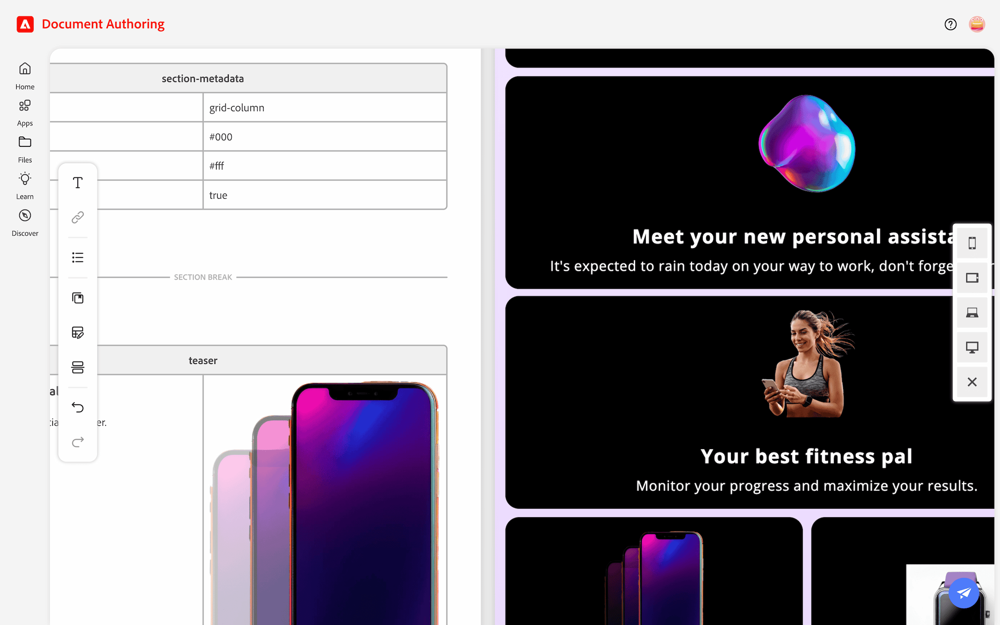

import { Code } from '@astrojs/starlight/components';
import { Steps } from '@astrojs/starlight/components';
import Diagram from '@components/Diagram.astro';
import Tasks from '@components/Tasks.astro';
import Task from '@components/Task.astro';

In this lesson, you will build and preview a featured product page for the iPhone 13. You will use the **Single Product Detail page** template to create a unique layout for the product.

<Tasks>

<Task>
### Create the page

<Steps>
1. Navigate to the `products` folder.
1. Create a new folder named `apple-iphone-13`.
1. Inside that folder, create a new document named `iphone-13`.
</Steps>

<Diagram caption="Create the new folder and document">
  
</Diagram>

</Task>

<Task>
### Apply the template

<Steps>
1. Open your `iphone-13` document.
1. From the Edit menu, click **Library** → **Templates**.
1. Select the *Single Product Detail page* template.
</Steps>

<Diagram caption="Apply the Template">
  
</Diagram>

</Task>

<Task>
### Preview the page

<Steps>
1. Click the instant **Preview** button.
1. Check the instant preview of the page.
</Steps>

<Diagram caption="Preview the Page">
  
</Diagram>
</Task>

<Task>
### Update the product-details block

The Single Product Detail page template comes with a `product-details` block, also known as a Product Detail Page (PDP) drop-in component. Like other document blocks, the PDP component is a two-column table — **property names** on the left, **property values** on the right. Make the following changes to the `product-details` block.

- `carousel-layout`: **`quad`** 
- `featured`: **`true`** 

<Diagram caption="Change the product-details block">
  
</Diagram>

:::tip[Use / (forward slash) to show valid property values]
With your cursor in the property value field, type `/` to see a list of valid property values.
:::

</Task>

<Task>
### Change the Hero block

<Steps>
1. Update the text below the image placeholder to: `Wide lens for great photos`.
1. Select the image placeholder.
1. Go to the Edit menu > **Library** > **AEM Assets**.
1. Navigate the **AEM Assets library** from the folders on the left (see screenshot): **All Assets** > **summit-l320**.
1. Choose the **iPhone image** shown in the screenshot below.
1. Click the **Select** button to apply the selected image.
</Steps>

<Diagram caption="Change the the Hero block">
  
</Diagram>

</Task>

<Task>
### Add Teaser blocks

The *Single Product Detail page* template comes with **4 teaser blocks**. You will replace the placeholder text and images of these blocks and add an additional block. All images are available in the lab's AEM Assets library: **Library** > **AEM Assets** > **All Assets** > **summit-l320**.

#### Teaser 1:
- Header 3: `Meet your new personal assistant` 
- Content: `It's expected to rain today on your way to work, don't forget your umbrella.`
- Image: `pdp-banner-one.png`

#### Teaser 2:
- Header 3: `Your best fitness pal`
- Content: `Monitor your progress and maximize your results.`
- Image: `fitness banner.png`

#### Teaser 3:
- Add *Teaser 3* by copying *Teaser 1* and pasting it directly below *Teaser 2*.
- Header 3: `New to CitiSignal?` 
- Content: `Check out our special trial offer.`
- Image: `pdp-banner-two.png`

#### Teaser 4:
- No header text
- Content: `Bundle and save, check eligibility now.`
- Image: `stock-watch-purple.png`

#### Teaser 5:
- No header text
- Content: `Students save more with CitiSignal.`
- Image: `ipad small banner.png`

{/* Page Break for PDF */}

<Diagram caption="Change and add teaser blocks">
  
</Diagram>

</Task>

<Task>
### Update page layout

The *Single Product Detail page* template uses a `grid-row` layout to place two or three blocks on the same row when the width of the screen allows. Let's change the layout to ensure that the first three teaser blocks are in a column layout. Make the following changes to the `section-metadata` block below the first two teasers (see screenshot).

- `style`: **`grid-column`** 

Select the tablet preview to ensure that these first two teaser blocks are displayed one per row.

<Diagram caption="Update the page layout">
  
</Diagram>

</Task>

<Task>
### Add Call To Action (CTA) buttons

<Steps>
1. Add text for a button in a teaser block (see screenshot).
1. Select the button text and go to menu → **Link**.
1. Add the URL for the link.
1. To make a primary button, bold the link text.
1. To make a secondary button, italicize the link text.
</Steps>

<Diagram caption="Add CTA buttons">
  
</Diagram>

</Task>

<Task>
### Preview the page

<Steps>
1. Click the **Action** button (paper-plane icon) at the top-right of the screen.
1. Choose the **Preview** button.
1. Check your work.
</Steps>

<Diagram caption="Final preview of the iPhone 13 product page" maxHeight="2500px">
  
</Diagram>

</Task>

<Task>
### Update the Hero banner with in-context editing

<Steps>
1. Open the `iphone-13` document.
1. Select the **in-context editing** button to open the document.
1. Scroll to the Hero banner and double-click its Text block to start editing.
1. Change the text to: `Capture breathtaking pictures with new wide lens`.
1. Preview your change by clicking the **Open page** button (directly left of the Publish button).
</Steps>

<Diagram caption="Update the Hero banner with in-context editing" maxHeight="700px">
  
</Diagram>
</Task>

<Task>
### Update the Hero banner with GenAI

<Steps>
1. Scroll to the Hero banner and select its Text block.
1. Click **AI Generate variations** button from the right-side menu.
1. View the selected Hero text in the AI panel followed by suggestions to rewrite the content.
1. Select one of the suggestions and click the **Generate** button.
1. Click the response you like to apply it to the Hero banner text.
1. Publish the page.
</Steps>

<Diagram caption="Update the Hero banner using GenAI">
  
</Diagram>
</Task>

</Tasks>
