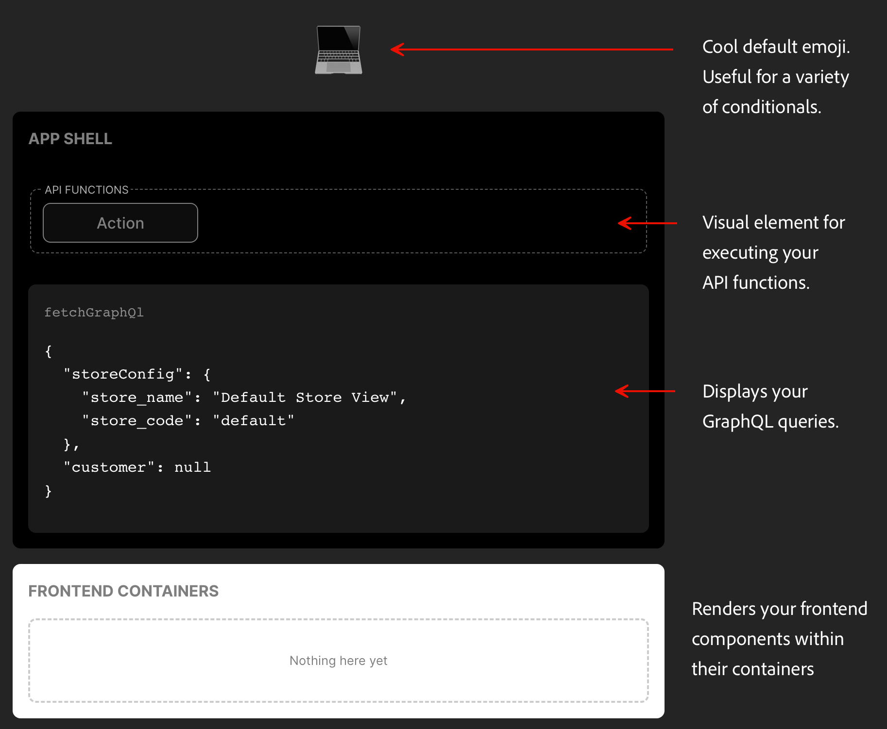

import { Tabs, TabItem } from '@astrojs/starlight/components';
import Diagram from '@components/Diagram.astro';
import Aside from '@components/Aside.astro';
import Tasks from '@components/Tasks.astro';
import Task from '@components/Task.astro';
import FileTree from '@components/FileTree.astro';
import ExternalLink from '@components/ExternalLink.astro';
import { Steps } from '@astrojs/starlight/components';

Follow this step-by-step guide to set up your development environment and create your first drop-in component using the Adobe Commerce Drop-in SDK. Whether you're new to drop-in components or looking to accelerate your workflow, this guide will help you scaffold, develop, and test robust UI components with best practices in mind.

## Prerequisites

Ensure you have the required tools and accounts before starting.

- **Node.js** (v20.13.1 or later) and **npm** (comes with Node.js). <ExternalLink href="https://nodejs.org/">Download Node.js</ExternalLink>
- Basic familiarity with JavaScript/TypeScript and the command line
- A GitHub account

**Troubleshooting:**  
If you see errors about missing Node.js, install it from <ExternalLink href="https://nodejs.org/">nodejs.org</ExternalLink>.

<Tasks>

<Task>
### Create your drop-in repository using the template

Start with a project template that provides all the necessary tooling and structure for building drop-in components.

<Steps>
1. Visit <ExternalLink href="https://github.com/adobe-commerce/dropin-template">adobe-commerce/dropin-template</ExternalLink>.
1. Click **Use this template** (top right) to create your own copy.
1. Name your repo to reflect your frontend (e.g., `login-page` or `acme-login`).
</Steps>

**Troubleshooting:**  
If you don't see the **Use this template** button, make sure you are logged into GitHub. 
</Task>

<Task>
### Clone your new repository

Download your new repository to your local machine.

<Steps>
1. Click the **Code** button and copy the SSH or HTTPS link.
1. Open your terminal and navigate to your desired directory.
1. Run the following command:
   ```bash
   git clone <your-repository-url>
   cd <your-repository-name>
   ```
</Steps>

**Troubleshooting:**  
If you get a "Permission denied" error, check your SSH keys or use HTTPS.
</Task>

<Task>
### Install the project dependencies

Install all required packages for development and testing.

Open your project and install dependencies with npm:

```bash
npm install
```

**Troubleshooting:**  
If you see errors about missing Node.js, install it from <ExternalLink href="https://nodejs.org/">nodejs.org</ExternalLink>.
</Task>

<Task>
### Generate the project config file

Create a `.elsie.js` config file, which the Elsie CLI uses to scaffold components, containers, and API functions.

Run the following command, replacing `<Domain>` with the name of the drop-in component you're building (e.g., `Login`):

```bash
npx elsie generate config --name <Domain>
```

After generating the `.elsie.js` config, open it and take a look. Below is an annotated version describing the main properties:

```js
module.exports = {
  name: 'Login',
  api: {
    root: './src/api',
    importAliasRoot: '@/login/api',
  },
  components: [
    {
      id: 'Components',
      root: './src/components',
      importAliasRoot: '@/login/components',
      cssPrefix: 'login',
      default: true,
    },
  ],
  containers: {
    root: './src/containers',
    importAliasRoot: '@/login/containers',
  },
  schema: {
    endpoint: process.env.ENDPOINT,
    headers: {}
  }
};
```

**Troubleshooting:**  
If `npx` is not found, ensure Node.js and npm are installed.
</Task>

<Task>
### Explore the project structure

Understand where to find and place your code.

<FileTree>
  - .storybook/ *-- Best-practice Storybook configurations right out of the box*
  - examples/
    - html-host/ *-- Preconfigured HTML UI for testing your drop-in components*
      - example.css
      - favicon.ico
      - index.html
      - styles.css
  - src/
    - api/  *-- By default, the Elsie CLI adds your API functions here*
    - data/ *-- TODO: Add a description*
    - docs/ *-- Provides an MDX template to document your frontend*
    - i18n/ *-- Internationalization setup with starter en_US.json file*
    - render/ *-- TODO: Add a description*
    - types/ *-- TODO: Add a description*
  - tests/ *-- TODO: Add a description*
  - elsie.js *-- Configuration file for creating components, containers and functions*
  - .env.local *-- Preconfigured settings for a development-only mesh endpoint*
  - .eslintrc.js *-- Preconfigured linting*
  - .gitignore
  - .jest.config.js *-- Preconfigured unit testing*
  - LICENSE *-- Adobe Drop-in Template License*
  - package.json *-- Preconfigured dependencies*
  - prettier.config.js *-- Preconfigured formatting*
  - README.md *-- Quick instructional overview of frontend development tasks*
  - storybook-stories.js *-- Additional storybook settings*
  - tsconfig.js *-- Preconfigured for TypeScript*
</FileTree>

</Task>

<Task>
### Update the mesh endpoint

Configure your project to connect to the correct backend.

By default, the project is configured to use a development-only mesh endpoint. This endpoint is only available when running the project locally. To use a different mesh endpoint:

<Steps>
1. Open `.env.local` in your project root.
1. Update the endpoint as needed.
</Steps>

**Troubleshooting:**  
If you see network errors when running the dev server, check your endpoint URL.
</Task>

<Task>
### Launch development environment

Start the local dev server and preview your components.

Run the following command to launch your project's development environment:

```bash
npm run dev
```

Congrats! You just launched your first drop-in component! Actually, what you're seeing is our frontend development environment. It's a preconfigured HTML page (`examples > html-host > index.html`) that loads your drop-in components for testing during development.

<Diagram caption="Frontend development environment">
  
</Diagram>

**Tip:**  
Stop the server with `Ctrl + C`.
</Task>

<Task>
### Generate a new UI Component

Scaffold a new UI component using the Elsie CLI.

Start by executing the following command, replacing `<MyUiComponent>` with the name of the component you want to add. For a login form, you might choose, `npx elsie generate component --pathname LoginForm`.

```bash
npx elsie generate component --pathname <MyUiComponent>
```

These files are preconfigured to work together. For example, the `LoginForm` component is automatically imported into `src/components/index.ts` so you can reference it throughout your project.

If you run `npm run dev` again, you'll see your new component in the Storybook UI, configured with an example and best practices.

**Example Output:**
```console
🆕 src/components/LoginForm/LoginForm.css created
🆕 src/components/LoginForm/LoginForm.stories.tsx created
🆕 src/components/LoginForm/LoginForm.test.tsx created
🆕 src/components/LoginForm/LoginForm.tsx created
🆕 src/components/LoginForm/index.ts created
🆕 src/components/index.ts created
```
</Task>

<Task>
### Generate a new API Function

Add backend logic (e.g., login/logout) to your frontend.

Start by executing the following command, replacing `<myApiFunction>` with the name of the API function you want to add. 

```bash
npx elsie generate api --pathname <myApiFunction>
```
For a login form, you might want to add `login` and `logout` functions as follows:

```bash
npx elsie generate api --pathname login
```
```bash
npx elsie generate api --pathname logout
```

Review the files generated in `src/api/`.
</Task>

<Task>
### Generate a Frontend Container

Create a container for grouping components and logic.

Start by executing the following command, replacing `<MyContainer>` with the name of the container you want to add. 

```bash
npx elsie generate container --pathname <MyContainer>
```

For a login form, you might choose:

```bash
npx elsie generate container --pathname LoginContainer
```

Review the files generated in `src/containers/`.
</Task>

<Task>
### Run unit tests

Ensure your components and logic work as expected.

Unit tests are also preconfigured for you. Run the following command to execute the basic default tests, and add to them as you build your frontend.

```bash
npm run test
```

Test results will appear in your terminal.
</Task>

<Task>
### Build production bundles

Prepare your frontend for deployment.

When you're ready to deploy your frontend, run the following command to build production bundles. Like everything else in the SDK, the basic process is configured for you, but you can customize it as you develop.

```bash
npm run build
```

A `dist/` directory with production-ready assets will be created.
</Task>

</Tasks>

## Best Practices & Accessibility

- Use meaningful names for components and API functions.
- Write tests for every component and function.
- Keep components small and focused.
- Document your code and update the MDX docs in `src/docs/`.
- Use Storybook to visually test components.
- Commit early and often; use branches for new features.
- Use clear, simple language in UI and documentation.
- Ensure all components are keyboard accessible.
- Add ARIA labels where appropriate.
- Test with screen readers.

**Common Pitfalls:**
- Forgetting to update `.env.local` for the correct endpoint.
- Not running `npm install` after cloning.
- Skipping tests before building for production.

## Summary and Next Steps

You've learned how to:

- Set up a drop-in component project
- Generate and configure components, API functions, and containers
- Run and test your frontend locally
- Build for production

**Next Steps:**

- Explore advanced component patterns
- Integrate with real backend APIs
- Contribute to the <ExternalLink href="https://github.com/adobe-commerce/dropin-template">dropin-template repo</ExternalLink>
