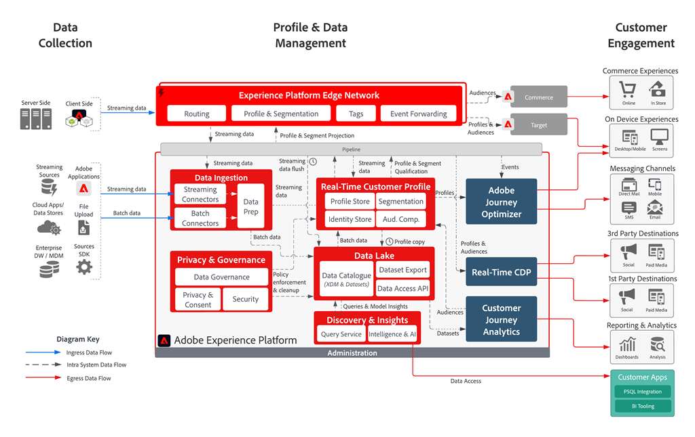

import OptionsTable from '@components/OptionsTable.astro';
import Diagram from '@components/Diagram.astro';
import CodeExample from '@components/CodeExample.astro';
import { Steps } from '@astrojs/starlight/components';
import Task from '@components/Task.astro';
import Tasks from '@components/Tasks.astro';
import Link from '@components/Link.astro';
import Aside from '@components/Aside.astro';

## Overview

Adobe Experience Platform (AEP) is a comprehensive suite of services that enables you to collect, unify, and analyze customer data from multiple touchpoints. By integrating your Adobe Commerce storefront with AEP, you can gain deeper insights into customer behavior and create more personalized experiences.

<Diagram caption="Adobe Experience Platform architecture showing data flow from various sources to unified customer profiles.">
  
</Diagram>

This integration allows your storefront to send commerce events (product views, purchases, cart actions) directly to the Experience Platform Edge Network, where they can be processed, stored, and used for real-time personalization and analytics.

For more information about Adobe Experience Platform capabilities, see the <Link href="https://experienceleague.adobe.com/docs/experience-platform/landing/home.html" text="Adobe Experience Platform documentation" />.

## Prerequisites

Before configuring your integration with Adobe Experience Platform, ensure you have the following:

### Required Identifiers

* **IMS Organization ID**: Your Adobe organization identifier (format: `1234567890ABCDEF7F000101@AdobeOrg`)
* **Datastream ID**: A configured datastream for routing data (format: `12345678-1234-1234-1234-123456789012`)

### How to Find Your Identifiers

**IMS Organization ID:**
To locate your IMS Organization ID, refer to the <Link href="https://experienceleague.adobe.com/docs/core-services/interface/administration/organizations.html" text="Organizations documentation" />. You can typically find this in:

- Adobe Admin Console
- Developer Console
- Any Adobe Experience Cloud application under Account Settings

**Datastream ID:**
Your datastream must be configured to route data to Adobe Experience Platform. For detailed instructions on creating and configuring a datastream, see the <Link href="https://experienceleague.adobe.com/docs/experience-platform/datastreams/overview.html" text="Datastreams documentation" />.

## Configuration

To enable data flow from your storefront to the Experience Platform Edge Network, you need to configure the Adobe Data Layer with your AEP credentials.

<Tasks>

<Task>
### Locate your delayed script file

Typically `scripts/delayed.js` in your project
</Task>

<Task>
### Add the AEP configuration to your Adobe Data Layer initialization

<CodeExample code={`
window.adobeDataLayer.push(
    {
      aepContext: {
        imsOrgId: '1234567890ABCDEF7F000101@AdobeOrg',
        datastreamId: '12345678-1234-1234-1234-123456789012'
      },
    }, 
    { 
      eventForwardingContext: {
        aep: true
      }
    },
);
`} lang="js" title="scripts/delayed.js" />

</Task>
</Tasks>

### Configuration Parameters

| Parameter | Description | Required |
|-----------|-------------|----------|
| `aepContext.imsOrgId` | Your Adobe IMS Organization ID | Yes |
| `aepContext.datastreamId` | Your configured datastream ID for routing data to AEP | Yes |
| `eventForwardingContext.aep` | Enables forwarding events to Adobe Experience Platform | Yes |

### What This Configuration Does

- **`aepContext`**: Provides the necessary identifiers for routing data to your specific Adobe Experience Platform environment
- **`eventForwardingContext.aep: true`**: Instructs the Adobe Data Layer to forward commerce events to the Experience Platform Edge Network

## Storefront events

Once configured, your storefront will automatically send the following types of events to Adobe Experience Platform:

- **Shopping events**: Cart updates and views (`addToCart`, `removeFromCart`, `shoppingCartView`), page views (`pageView`, `productPageView`), checkout (`startCheckout`, `completeCheckout`) and more.
- **Customer profile events**: Customer login (`signIn`), customer logout (`signOut`), create account (`createAccount`), edit account (`editAccount`).
- **Search events**: Search query (`searchRequestSent`) and search results (`searchResponseReceived`).

<Aside type="note" title="Search events">
If `LiveSearch` is not installed and configured, these search events are not sent.
</Aside>

For a complete list of storefront events, see the <Link href="https://github.com/adobe/elsie/blob/main/src/content/docs/sdk/reference/events.md" text="Storefront events documentation" />.

<Aside type="note" title="Debugging events">
To debug events in your storefront, you can use the AEP Debugger Events view. For instructions on how to use the <Link href="https://experienceleague.adobe.com/docs/experience-platform/debugger/home.html" text="AEP Debugger video tutorial" />.
</Aside>

These events are processed in real-time and can be used for:
- Customer journey analysis
- Real-time personalization
- Audience segmentation
- Attribution modeling

## Validation

You can see an example of this <Link href="https://github.com/hlxsites/aem-boilerplate-commerce/commit/eb49d00bcebd21e48cd87c0efced17d2c6ccfd9d" text="in the Commerce Boilerplate" />.

### Testing Your Integration

<Tasks>

<Task>
### Check browser console

After implementing the configuration, open your browser's developer tools and verify that:

- No JavaScript errors appear
- Adobe Data Layer events are being fired
- Network requests to Adobe Experience Platform Edge Network are successful
</Task>

<Task>
### Monitor data ingestion

Use Adobe Experience Platform's monitoring tools to confirm data is being received:

- Navigate to your AEP workspace
- Check the **Monitoring** section for incoming data
- Verify events appear in your configured datasets
</Task>

</Tasks>

### Validate event structure

Ensure events contain the expected commerce data fields and customer identifiers

### Troubleshooting

If data is not flowing as expected:

- **Verify credentials**: Double-check your IMS Organization ID and Datastream ID
- **Check datastream configuration**: Ensure your datastream is properly configured to route to Adobe Experience Platform
- **Review browser network tab**: Look for failed requests to Adobe Experience Platform endpoints
- **Validate Adobe Data Layer**: Confirm the Adobe Data Layer is properly initialized before your AEP configuration

For detailed validation procedures, refer to the <Link href="https://experienceleague.adobe.com/docs/platform-learn/getting-started-for-data-architects-and-data-engineers/ingest-batch-data.html" text="Data Ingestion Monitoring documentation" />.

## Next Steps

After successful integration:

<Steps>
1. **Configure schemas**: Set up XDM schemas in Adobe Experience Platform to structure your commerce data  
1. **Create audiences**: Build customer segments based on commerce behavior
1. **Set up Real-Time CDP**: Use collected data for personalization and marketing activation
1. **Monitor performance**: Regularly review data quality and ingestion metrics
</Steps>

For a complete implementation example, see the <Link href="https://experienceleague.adobe.com/docs/core-services/interface/administration/organizations.html" text="Organizations documentation" /> and <Link href="https://github.com/hlxsites/aem-boilerplate-commerce" text="AEM Commerce Boilerplate integration" />.
